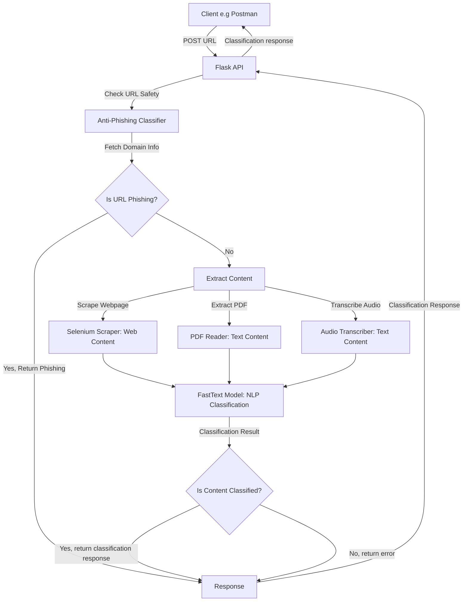
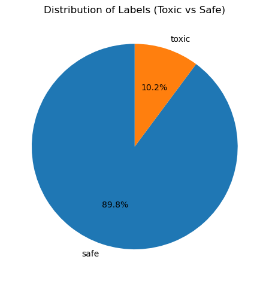
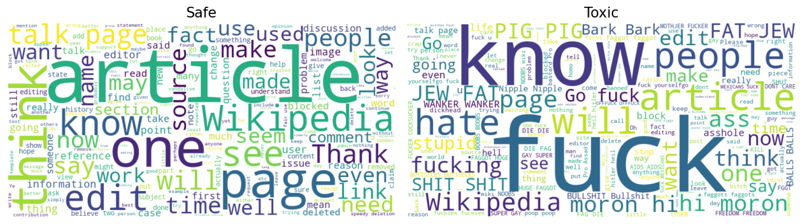
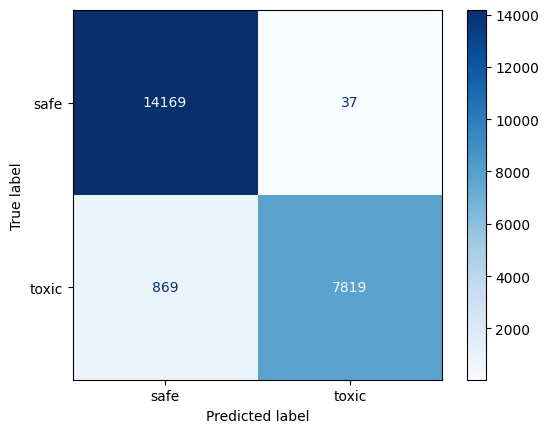

# Classification of Internet resources, including websites, for the purpose of constructing the parental control systems to counteract access to unwanted information.

Parental control systems are vital for protecting children from harmful online content by classifying and filtering internet resources, including websites, audio files, and PDFs. These systems empower parents to monitor and block access to inappropriate or malicious material, fostering a secure digital environment. This paper presents an anti-phishing and content classification system that integrates a custom machine learning model for phishing detection with natural language processing (NLP) using FastText and the Google Gemini API to categorize internet resources for parental control applications.

Our approach combines robust phishing detection with content analysis to identify malicious URLs and assess the appropriateness of non-malicious content, such as web pages, PDFs, and audio. We developed a Flask API that processes URLs, evaluates phishing risks, extracts content based on file extensions, and applies FastText and Gemini for NLP-based classification. This system enhances parental control by flagging phishing threats and categorizing content to prevent exposure to harmful material, such as explicit text or toxic comments, ensuring a safer online experience for children.

## System Architecture

The system operates through a Flask API that handles URL classification in a multi-step workflow, as shown in the diagram below:

## 2 Flask API Implementation

The Flask API integrates several scripts:

- Selenium Web Scraper: Extracts text from webpages, handling dynamic content.

- PDF Reader: Used PyPDF2 to extract text from PDF files.

- Audio Transcriber: Employs speech_recognition library to transcribe audio files.

FastText Model: Performs NLP-based classification of extracted text, identifying categories relevant to parental controls (e.g., safe, unsafe).

The API was tested using Postman, with results visualized in the following screenshots:

| Anti-Phishing Classification                                           | Audio Content Classification                                              |
| ---------------------------------------------------------------------- | ------------------------------------------------------------------------- |
|  |  |

| Web Scraping and Classification                                                     | PDF Content Classification                                     |
| ----------------------------------------------------------------------------------- | -------------------------------------------------------------- |
|  |  |

| Gambling Website Classification                                            | Additional Example                           |
| -------------------------------------------------------------------------- | -------------------------------------------- |
|  |  |

## 3. FastText NLP Model for Content Classification

Natural Language Processing (NLP) is critical for analyzing and classifying text content to identify inappropriate or harmful material, a key requirement for parental control systems. We employed FastText, an efficient and scalable NLP library, to classify text extracted from internet resources (web pages, PDFs, audio) as safe or toxic (unsafe) [4]. FastText’s linear classifier enables rapid training, processing up to 1 billion words in under 10 minutes, making it ideal for real-time applications compared to slower deep neural networks [1, 2]. This complements the Gemini API’s NLP classification in our Flask API, offering a lightweight alternative for toxic content detection to protect children online.

### 3.1 FastText Methodology

FastText represents text and labels as vectors, training a linear classifier to align text vectors with their corresponding label vectors (e.g., safe or toxic). The actual model fastText implements is rather simple as we can see in the image below:

$$ - \frac{1}{N} \sum\_{n=1}^{N} y_n \log(f(BAd_n)) $$

where

- $d_n$ is the representation of the $n$-th document (denoted `hidden` in the image below)
- $A$ is the "document" embedding matrix
- $B$ is the linear projection from "document" embeddings to output classes
- $f$ is the `softmax` non-linearity function
- $y_n$ is the label of the $n$-th document

The probability of a correct label given a text is computed using the softmax function:

$
P(y_y | x) = \frac{\exp(w_y \cdot x)}{\sum_{y} \exp(w_y \cdot x)}
$

where $x$ is the text vector, $w_y$ is the weight vector for label $y$, and the denominator normalizes over all labels [2]. We used bigrams (`wordNgrams=2`), as they capture word order effectively, allowing reconstruction of sentence structure from n-gram sequences [2]. This enhances classification accuracy for short, context-dependent texts common in online content.

### 3.2 Dataset and Feature Engineering

We trained the FastText model on the Jigsaw Toxic Comment Classification Challenge dataset [3], containing 159,571 comments labeled across six categories: toxic, severe_toxic, obscene, threat, insult, and identity_hate. To align with parental control needs, we simplified these into binary labels:

- **Safe**: Comments with no toxic labels.
- **Toxic (Unsafe)**: Comments with any toxic label (e.g., toxic, obscene).

This binary classification focuses on identifying harmful content unsuitable for children. The dataset was split 80:20 for training and testing. Text preprocessing included lowercasing, removing special characters, and tokenization, as recommended for FastText [4]. Future work will incorporate datasets for betting, adult content, and gambling to expand coverage of inappropriate material, enhancing the model’s applicability to parental controls.

#### 3.2.1 Class Distribution

The distribution of safe and toxic labels is visualized below, highlighting the dataset’s imbalance (more safe comments), which FastText handles effectively through its loss function [2].

_Figure 6: Distribution of safe and toxic labels, showing a higher proportion of safe comments._

A word cloud illustrates key terms in safe and toxic comments, aiding in understanding linguistic patterns for parental control filtering.

_Figure 7: Word cloud of safe and toxic comments, highlighting terms like insults in toxic content._

### 3.3 Model Training and Evaluation

The FastText model was trained with the following parameters:

- **wordNgrams=2**: Bigrams to capture word order and context.
- **Learning Rate**: 0.1 (default, optimized for convergence).
- **Epochs**: 5, balancing accuracy and training time [4].

The model achieved high performance on the test set, evaluated using accuracy, precision, recall, and F1-score, critical for ensuring toxic content is flagged for parental controls [5].

- **Accuracy**: 0.9604
- **Classification Report**:

| Class            | Precision | Recall | F1-Score | Support    |
| ---------------- | --------- | ------ | -------- | ---------- |
| Safe             | 0.94      | 0.98   | 0.97     | 14,206     |
| Toxic            | 0.98      | 0.90   | 0.95     | 8,688      |
| **Accuracy**     |           |        | **0.96** | **22,894** |
| **Macro Avg**    | 0.97      | 0.95   | 0.96     | 22,894     |
| **Weighted Avg** | 0.96      | 0.96   | 0.96     | 22,894     |

_Figure 8: Confusion matrix for FastText, showing high accuracy in classifying safe and toxic comments._

### Analysis

The FastText model achieved an accuracy of 96.04%, with strong precision (0.98) and recall (0.90) for toxic comments, ensuring most harmful content is detected, a priority for parental control systems [5]. The high recall for safe comments (0.98) minimizes false positives, allowing safe content to pass through filters. Bigrams contributed to robust performance by capturing contextual patterns in toxic language [2]. However, the lower recall for toxic comments (0.90) suggests some harmful content may be missed, which could be addressed by incorporating additional datasets (e.g., betting, adult content) or fine-tuning parameters [4].

## 4 Anti-Phishing classifier

The anti-phishing classifier is a critical component, as phishing URLs pose significant risks to children by directing them to malicious sites. We trained our model using the Malicious URLs dataset from Kaggle [4], which contains 651,191 URLs: 428,103 benign, 96,457 defacement, 94,111 phishing, and 32,520 malware URLs. To manage computational resources, we used 20% of the dataset (130,238 URLs) and enriched it with domain features.

### 4.1 Dataset and Feature Engineering

We fetched domain information using WHOIS queries to add:

- Domain Age: Number of days since domain registration, as newer domains are often malicious [5].

- Domain Status: Categorized based on registration status (e.g., active, expired), indicating reliability.

Additional features were derived from URL characteristics, including:

- Domain Name Entropy: Calculated using Shannon’s entropy formula to measure randomness in domain names, as malicious URLs often have higher entropy [6]:

$$H(X) = -\sum_{i=1}^{n} p(x_i) \log_b p(x_i)$$

- Other Features: Included URL length, special character count, and subdomain presence, which are effective for phishing detection [7].

### 4.2 The class distribution and feature importance are visualized below:

#### 4.2.1 Class Distribution

#### 4.2.2 Mean Domain Entropy by Type

#### 4.2.3 Other Features Mean by Type

The following mean bar charts illustrate several important features that can aid in phishing detection, categorized by URL type.

### 4.3 Model Training and Evaluation

We implemented two classifiers: Random Forest and XGBoost, both suitable for multi-class classification of URLs (benign, defacement, phishing, malware) [3]. The dataset was split 80:20 for training and testing, with performance evaluated using accuracy, precision, recall, and F1-score.

#### 4.3.1 Random Forest Classifier

- **Accuracy**: 0.9291

##### **Classification Report:**

| Class            | Precision | Recall | F1-Score | Support   |
| ---------------- | --------- | ------ | -------- | --------- |
| Benign           | 0.93      | 0.98   | 0.95     | 18260     |
| Defacement       | 0.94      | 0.94   | 0.94     | 5854      |
| Phishing         | 0.90      | 0.76   | 0.82     | 5761      |
| Malware          | 0.98      | 0.91   | 0.95     | 1984      |
| **Accuracy**     |           |        | **0.93** | **31859** |
| **Macro Avg**    | 0.94      | 0.90   | 0.92     | 31859     |
| **Weighted Avg** | 0.93      | 0.93   | 0.93     | 31859     |

#### 4.3.2 XGBoost Classifier

- **Accuracy**: 0.9304

##### **Classification Report:**

| Class            | Precision | Recall | F1-Score | Support   |
| ---------------- | --------- | ------ | -------- | --------- |
| Benign           | 0.94      | 0.97   | 0.95     | 18260     |
| Defacement       | 0.94      | 0.95   | 0.95     | 5854      |
| Phishing         | 0.87      | 0.79   | 0.83     | 5761      |
| Malware          | 0.97      | 0.93   | 0.95     | 1984      |
| **Accuracy**     |           |        | **0.93** | **31859** |
| **Macro Avg**    | 0.93      | 0.91   | 0.92     | 31859     |
| **Weighted Avg** | 0.93      | 0.93   | 0.93     | 31859     |

### 4.4 Analysis

Both classifiers achieved high accuracy (~93%), with XGBoost slightly outperforming Random Forest (0.9304 vs. 0.9291). XGBoost showed better recall for phishing URLs (0.79 vs. 0.76), critical for parental control to minimize false negatives (missed phishing sites). The high entropy of phishing and malware URLs, as shown in Figure 2, was a key discriminative feature, consistent with findings in [6]. However, phishing URLs had lower recall, indicating challenges in detecting subtle phishing patterns, which could be addressed with additional features or models [7].

## 5. Next Steps

To enhance the system for parental control applications, we propose:

- Image and Video Classification: Extend the system to classify images and videos, common in harmful content, using convolutional neural networks (CNNs) [7].

- Text Document Support: Add support for other text formats (e.g., .docx, .txt) to broaden content coverage.

- Model Optimization: Optimize Random Forest and XGBoost for faster inference (e.g., feature selection, model pruning) to reduce API latency.

- Real-Time Monitoring: Implement a browser extension integrating the API for real-time URL and content filtering, enhancing usability for parents.

## Conclusion

This paper introduces a comprehensive system for classifying internet resources to strengthen parental control systems, protecting children from malicious and inappropriate online content. Our Flask API integrates a custom anti-phishing classifier with NLP-based content analysis, leveraging FastText for toxic comment detection and the Google Gemini API for broader content classification. Trained on a subset of the Malicious URLs dataset [3], the anti-phishing classifier achieved ~93% accuracy using Random Forest and XGBoost, with domain entropy proving pivotal for identifying phishing URLs [4]. FastText’s 96% accuracy in classifying safe versus toxic text, combined with Gemini’s granular analysis of web pages, PDFs, and audio, enables robust filtering of harmful material like phishing scams and explicit comments. This system empowers parents to ensure safer online experiences for children. Future enhancements, outlined in “Next Steps,” will expand content coverage and optimize performance, advancing secure digital environments.

## references

1. GeeksforGeeks. (2023). FastText Working and Implementation. Retrieved from [https://www.geeksforgeeks.org/fasttext-working-and-implementation/](https://www.geeksforgeeks.org/fasttext-working-and-implementation/).
2. Joulin, A., Grave, E., Bojanowski, P., & Mikolov, T. (2016). Bag of Tricks for Efficient Text Classification. arXiv preprint arXiv:1607.01759. [https://arxiv.org/abs/1607.01759](https://arxiv.org/abs/1607.01759).
3. Kaggle. (2018). Jigsaw Toxic Comment Classification Challenge. Retrieved from [https://www.kaggle.com/datasets/julian3833/jigsaw-toxic-comment-classification-challenge](https://www.kaggle.com/datasets/julian3833/jigsaw-toxic-comment-classification-challenge).
4. Bojanowski, P., Grave, E., Joulin, A., & Mikolov, T. (2017). Enriching Word Vectors with Subword Information. Transactions of the Association for Computational Linguistics, 5, 135–146. [https://doi.org/10.1162/tacl_a_00051](https://doi.org/10.1162/tacl_a_00051).
5. [Malicious URLs dataset](https://www.kaggle.com/datasets/sid321axn/malicious-urls-dataset/data)
6. [Malicious URL Detection Based on Associative Classification](https://www.mdpi.com/1099-4300/23/2/182)
7. [Feature-based Malicious URL and Attack Type Detection Using Multi-class Classification](https://www.isecure-journal.com/article_159689_889aebb80d0e4b48c23526d76f52bd9e.pdf)
8. [librivox](https://librivox.org/on-chronic-alcoholic-intoxication-by-william-marcet/)
