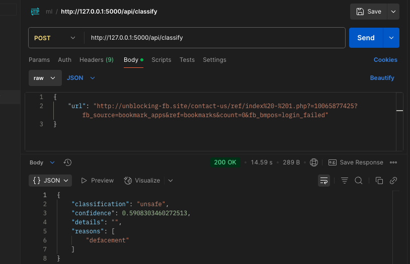
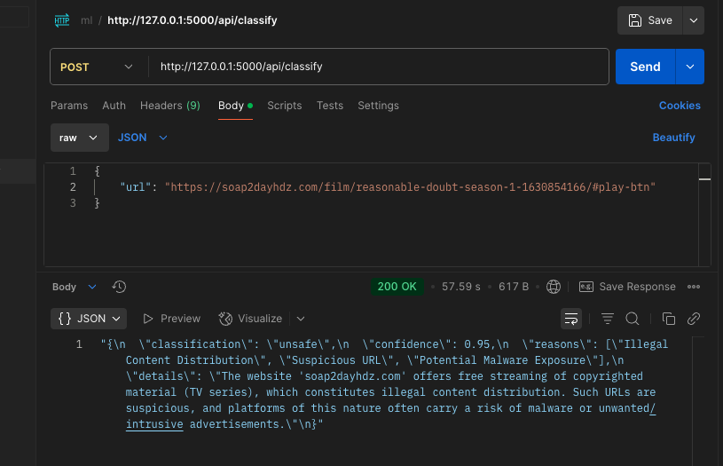
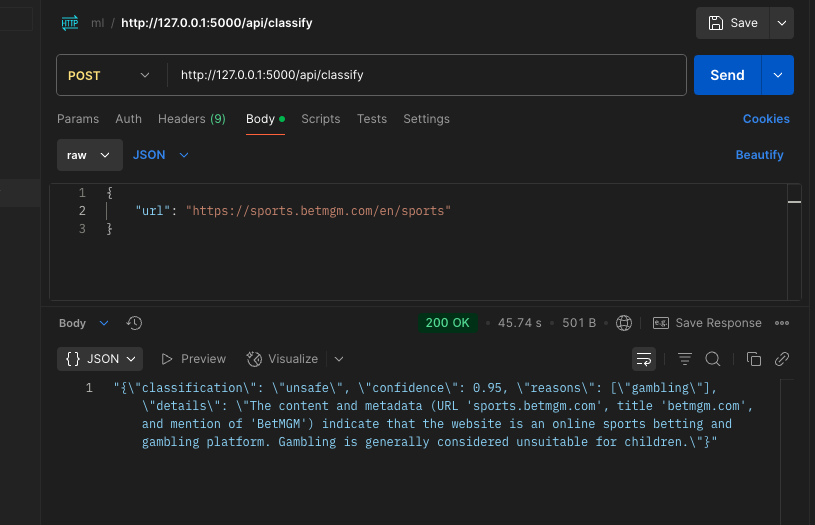
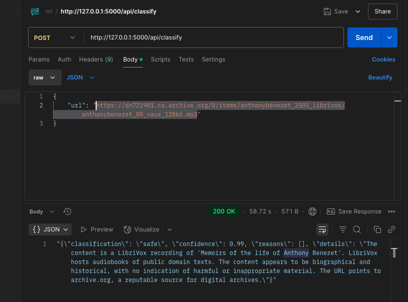
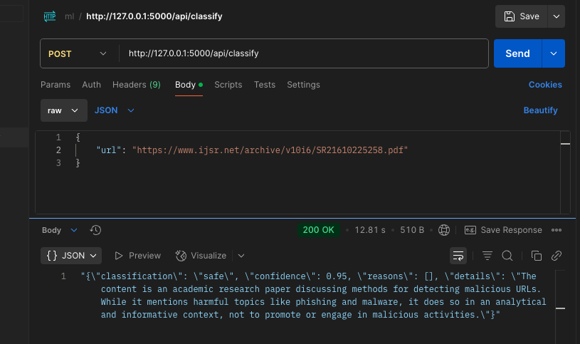
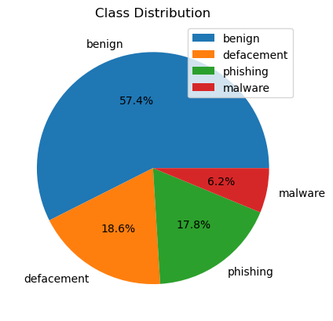
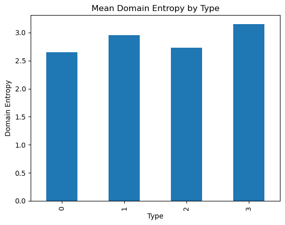
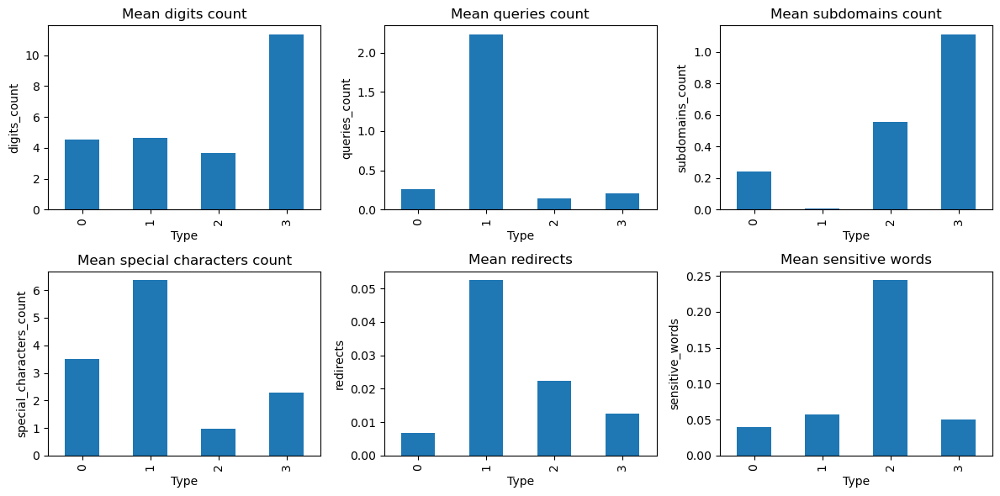
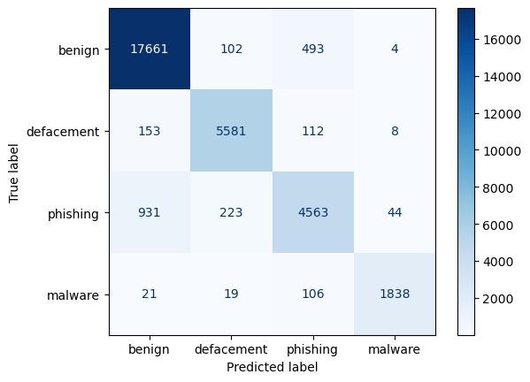

# Classification of Internet resources, including websites, for the purpose of constructing the parental control systems to counteract access to unwanted information.

Parental control systems are essential tools for safeguarding children from harmful online content by classifying and filtering internet resources, such as websites, audio files, and PDFs. These systems enable parents to monitor and restrict access to inappropriate or malicious content, ensuring a safe digital environment. This paper focuses on an anti-phishing and content classification system that leverages a custom machine learning model and natural language processing (NLP) via the Google Gemini API to categorize internet resources for parental control applications.

Our approach combines phishing detection with content analysis to identify malicious URLs and classify non-malicious content (web pages, PDFs, audio) for appropriateness. We developed a Flask API that processes URLs, checks for phishing risks, extracts content based on file extensions, and uses Gemini for NLP-based classification. This system supports parental control by flagging phishing threats and categorizing content to prevent exposure to unwanted material, such as explicit or harmful texts.

## System Architecture

The system operates through a Flask API that handles URL classification in a multi-step workflow, as shown in the diagram below:

## 2 Flask API Implementation

The Flask API integrates several scripts:

- Selenium Web Scraper: Extracts text from webpages, handling dynamic content.

- PDF Reader: Used PyPDF2 to extract text from PDF files.

- Audio Transcriber: Employs speech_recognition library to transcribe audio files.

Gemini API: Performs NLP-based classification of extracted text, identifying categories relevant to parental controls (e.g., safe, explicit, gambling).

The API was tested using Postman, with results visualized in the following screenshots:

| Anti-Phishing Classification                                           | Audio Content Classification                                              |
| ---------------------------------------------------------------------- | ------------------------------------------------------------------------- |
|  |  |

| Web Scraping and Classification                                                     | PDF Content Classification                                     |
| ----------------------------------------------------------------------------------- | -------------------------------------------------------------- |
|  |  |

| Gambling Website Classification                                            | Additional Example                           |
| -------------------------------------------------------------------------- | -------------------------------------------- |
|  |  |

## 3 Anti-Phishing classifier

The anti-phishing classifier is a critical component, as phishing URLs pose significant risks to children by directing them to malicious sites. We trained our model using the Malicious URLs dataset from Kaggle [1], which contains 651,191 URLs: 428,103 benign, 96,457 defacement, 94,111 phishing, and 32,520 malware URLs. To manage computational resources, we used 20% of the dataset (130,238 URLs) and enriched it with domain features.

### 3.1 Dataset and Feature Engineering

We fetched domain information using WHOIS queries to add:

- Domain Age: Number of days since domain registration, as newer domains are often malicious [2].

- Domain Status: Categorized based on registration status (e.g., active, expired), indicating reliability.

Additional features were derived from URL characteristics, including:

- Domain Name Entropy: Calculated using Shannon’s entropy formula to measure randomness in domain names, as malicious URLs often have higher entropy [3]:

$$H(X) = -\sum_{i=1}^{n} p(x_i) \log_b p(x_i)$$

- Other Features: Included URL length, special character count, and subdomain presence, which are effective for phishing detection [4].

### 3.2 The class distribution and feature importance are visualized below:

#### 3.2.1 Class Distribution

#### 3.2.2 Mean Domain Entropy by Type

#### 3.2.3 Other Features Mean by Type

The following mean bar charts illustrate several important features that can aid in phishing detection, categorized by URL type.

### 3.3 Model Training and Evaluation

We implemented two classifiers: Random Forest and XGBoost, both suitable for multi-class classification of URLs (benign, defacement, phishing, malware) [3]. The dataset was split 80:20 for training and testing, with performance evaluated using accuracy, precision, recall, and F1-score.

#### 3.3.1 Random Forest Classifier

- **Accuracy**: 0.9291

##### **Classification Report:**

| Class            | Precision | Recall | F1-Score | Support   |
| ---------------- | --------- | ------ | -------- | --------- |
| Benign                | 0.93      | 0.98   | 0.95     | 18260     |
| Defacement                | 0.94      | 0.94   | 0.94     | 5854      |
| Phishing                | 0.90      | 0.76   | 0.82     | 5761      |
| Malware                | 0.98      | 0.91   | 0.95     | 1984      |
| **Accuracy**     |           |        | **0.93** | **31859** |
| **Macro Avg**    | 0.94      | 0.90   | 0.92     | 31859     |
| **Weighted Avg** | 0.93      | 0.93   | 0.93     | 31859     |

#### 3.3.2 XGBoost Classifier

- **Accuracy**: 0.9304

##### **Classification Report:**

| Class            | Precision | Recall | F1-Score | Support   |
| ---------------- | --------- | ------ | -------- | --------- |
| Benign               | 0.94      | 0.97   | 0.95     | 18260     |
| Defacement                | 0.94      | 0.95   | 0.95     | 5854      |
| Phishing                | 0.87      | 0.79   | 0.83     | 5761      |
| Malware               | 0.97      | 0.93   | 0.95     | 1984      |
| **Accuracy**     |           |        | **0.93** | **31859** |
| **Macro Avg**    | 0.93      | 0.91   | 0.92     | 31859     |
| **Weighted Avg** | 0.93      | 0.93   | 0.93     | 31859     |

### 3.4 Analysis

Both classifiers achieved high accuracy (~93%), with XGBoost slightly outperforming Random Forest (0.9304 vs. 0.9291). XGBoost showed better recall for phishing URLs (0.79 vs. 0.76), critical for parental control to minimize false negatives (missed phishing sites). The high entropy of phishing and malware URLs, as shown in Figure 2, was a key discriminative feature, consistent with findings in [3]. However, phishing URLs had lower recall, indicating challenges in detecting subtle phishing patterns, which could be addressed with additional features or models [4].

## 4. Next Steps

To enhance the system for parental control applications, we propose:

- Custom NLP Model: Develop a tailored NLP model for granular content classification (e.g., violence, explicit language), reducing reliance on the Gemini API and improving latency.

- Image and Video Classification: Extend the system to classify images and videos, common in harmful content, using convolutional neural networks (CNNs) [5].

- Text Document Support: Add support for other text formats (e.g., .docx, .txt) to broaden content coverage.

- Model Optimization: Optimize Random Forest and XGBoost for faster inference (e.g., feature selection, model pruning) to reduce API latency.

- Real-Time Monitoring: Implement a browser extension integrating the API for real-time URL and content filtering, enhancing usability for parents.

## conclusion

## Conclusion

This paper presents a robust system for classifying internet resources to enhance parental control systems, effectively counteracting access to unwanted and malicious content. By integrating a custom anti-phishing classifier with NLP-based content analysis via the Google Gemini API, our Flask API successfully identifies phishing URLs and categorizes web pages, PDFs, and audio content for appropriateness. The anti-phishing classifier, trained on a subset of the Malicious URLs dataset [1], achieved high accuracy (~93%) using Random Forest and XGBoost, with features like domain entropy proving critical for detecting malicious URLs [3, 4]. The Gemini API further enabled granular classification of extracted content, supporting parental control goals by flagging harmful material.

## references

1. [Malicious URLs dataset](https://www.kaggle.com/datasets/sid321axn/malicious-urls-dataset/data)
2. [Malicious URL Detection Based on Associative Classification](https://www.mdpi.com/1099-4300/23/2/182)
3. [Feature-based Malicious URL and Attack Type Detection Using Multi-class Classification](https://www.isecure-journal.com/article_159689_889aebb80d0e4b48c23526d76f52bd9e.pdf)
4. [librivox](https://librivox.org/on-chronic-alcoholic-intoxication-by-william-marcet/)
