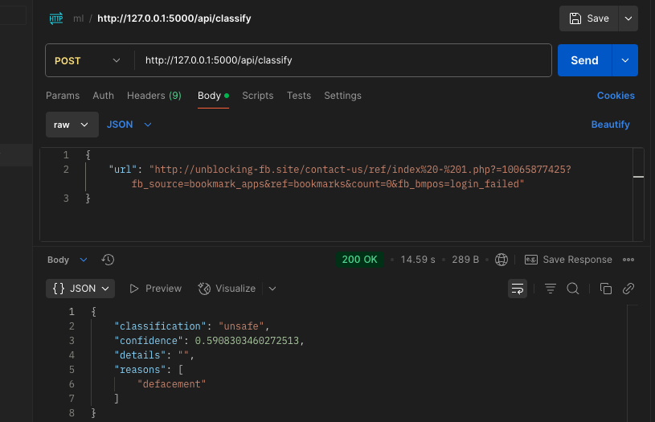
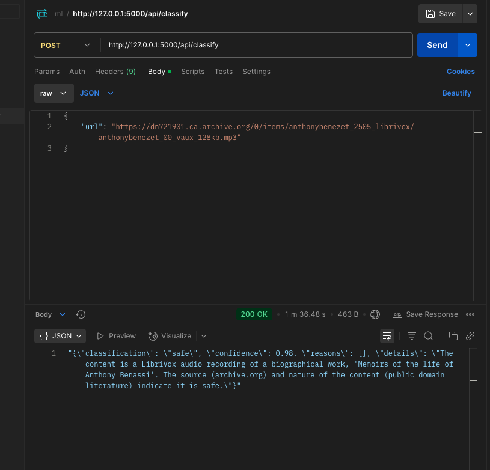
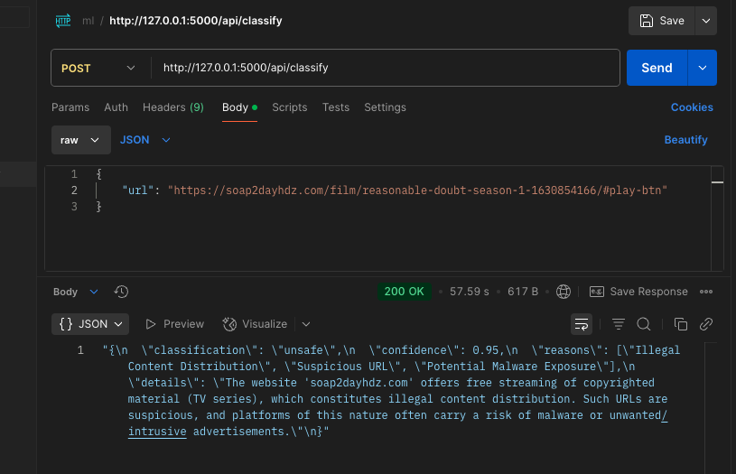
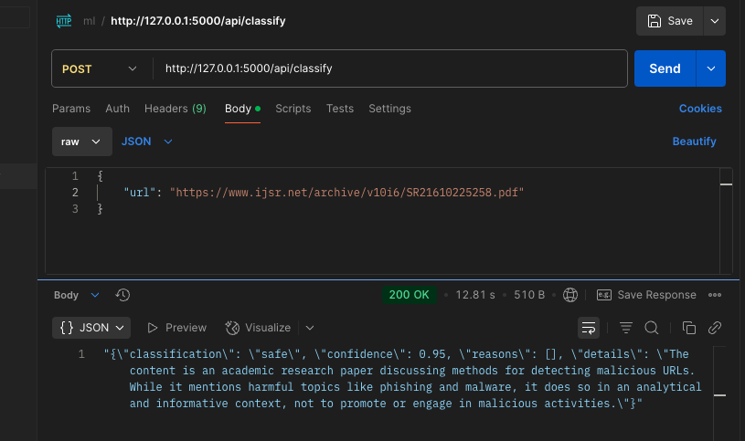
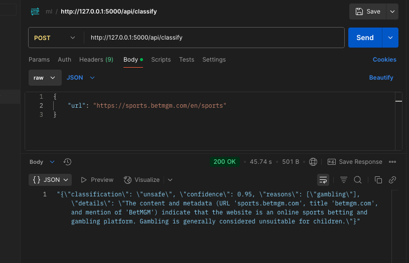
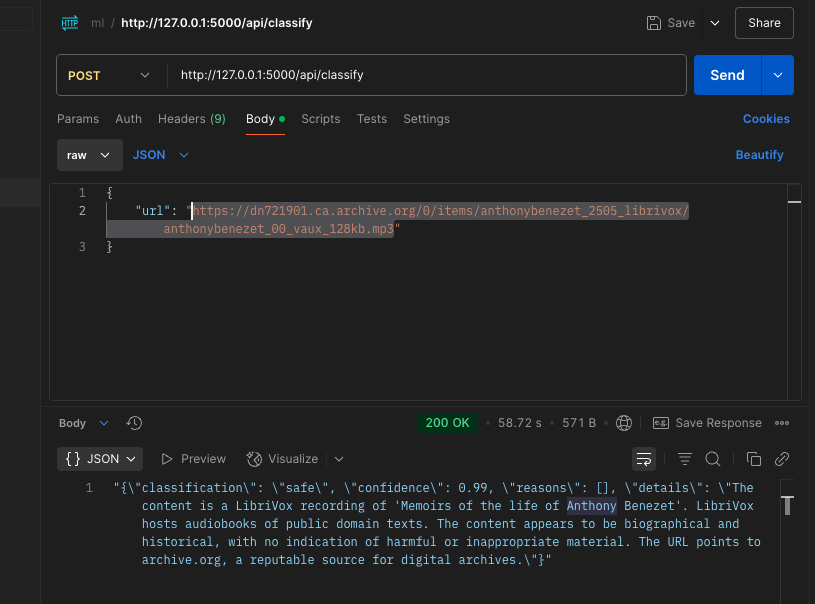

# phishing-classifier

## references

1. [Malicious URL Detection Based on Associative Classification](https://www.mdpi.com/1099-4300/23/2/182)
2. [Feature-based Malicious URL and Attack Type Detection Using Multi-class Classification](https://www.isecure-journal.com/article_159689_889aebb80d0e4b48c23526d76f52bd9e.pdf)
3. [librivox](https://librivox.org/on-chronic-alcoholic-intoxication-by-william-marcet/)
