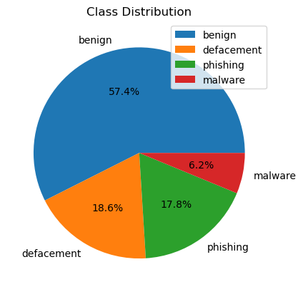

# Классификация интернет-ресурсов, включая веб-сайты, с целью создания систем родительского контроля для противодействия доступу к нежелательной информации.

Системы родительского контроля являются важными инструментами для защиты детей от вредного онлайн-контента, классифицируя и фильтруя интернет-ресурсы, такие как веб-сайты, аудиофайлы и PDF-документы. Эти системы позволяют родителям контролировать и ограничивать доступ к неподобающему или вредоносному контенту, обеспечивая безопасную цифровую среду. В данной работе рассматривается система противодействия фишингу и классификации контента, которая использует пользовательскую модель машинного обучения и обработку естественного языка (NLP) через API Google Gemini для категоризации интернет-ресурсов для приложений родительского контроля.

Наш подход сочетает в себе обнаружение фишинга с анализом контента для идентификации вредоносных URL и классификации невредоносного контента (веб-страницы, PDF, аудио) по соответствию. Мы разработали API Flask, который обрабатывает URL, проверяет риски фишинга, извлекает контент на основе расширений файлов и использует Gemini для классификации на основе NLP. Эта система поддерживает родительский контроль, отмечая угрозы фишинга и классифицируя контент, чтобы предотвратить доступ к нежелательным материалам, таким как откровенные или вредные тексты.

## Архитектура системы

Система работает через API Flask, который обрабатывает классификацию URL в многоступенчатом рабочем процессе, как показано на диаграмме ниже:

## Реализация API Flask

API Flask интегрирует несколько скриптов:

- Скрейпер веб-страниц Selenium: Извлекает текст с веб-страниц, обрабатывая динамический контент.

- Читатель PDF: Использует PyPDF2 для извлечения текста из PDF-документов.

- Транскрибатор аудио: Использует библиотеку speech_recognition для транскрибирования аудиофайлов.

API Gemini: Выполняет классификацию на основе NLP извлеченного текста, определяя категории, относящиеся к родительскому контролю (например, безопасный, откровенный, азартные игры).

API был протестирован с использованием Postman, результаты визуализированы на следующих скриншотах:

| Классификация противодействия фишингу                                               | Классификация аудиоконтента                                             |
| ----------------------------------------------------------------------------------- | ----------------------------------------------------------------------- |
|  |  |

| Веб-скрейпинг и классификация                                               | Классификация контента PDF                                     |
| --------------------------------------------------------------------------- | -------------------------------------------------------------- |
|  |  |

| Классификация веб-сайтов азартных игр                                              | Дополнительный пример                        |
| ---------------------------------------------------------------------------------- | -------------------------------------------- |
|  |  |

## 3 Классификатор противодействия фишингу

Классификатор противодействия фишингу является критически важным компонентом, поскольку фишинговые URL представляют собой значительные риски для детей, направляя их на вредоносные сайты. Мы обучили нашу модель, используя набор данных Malicious URLs с Kaggle, который содержит 651,191 URL: 428,103 доброкачественных, 96,457 для взлома, 94,111 фишинговых и 32,520 вредоносных URL. Для управления вычислительными ресурсами мы использовали 20% набора данных (130,238 URL) и обогатили его характеристиками доменов.

### 3.1 Набор данных и инженерия признаков

Мы извлекли информацию о домене, используя запросы WHOIS, чтобы добавить:

- **Возраст домена**: Количество дней с момента регистрации домена, так как новые домены часто являются вредоносными.

- **Статус домена**: Классифицированный на основе статуса регистрации (например, активный, истекший), что указывает на надежность.

Дополнительные признаки были получены из характеристик URL, включая:

- **Энтропия имени домена**: Рассчитывается с использованием формулы энтропии Шеннона для измерения случайности в именах доменов, так как вредоносные URL часто имеют более высокую энтропию:

$$H(X) = -\sum_{i=1}^{n} p(x_i) \log_b p(x_i)$$

- **Другие признаки**: Включали длину URL, количество специальных символов и наличие поддоменов, которые эффективны для обнаружения фишинга.

### 3.2 Распределение классов и важность признаков визуализированы ниже:

#### 3.2.1 Распределение классов

#### 3.2.2 Средняя энтропия домена по типу

#### 3.2.3 Средние значения других признаков по типу

Следующие столбчатые диаграммы показывают несколько важных признаков, которые могут помочь в обнаружении фишинга, классифицированных по типу URL.

### 3.3 Обучение и оценка модели

Мы реализовали два классификатора: Random Forest и XGBoost, оба подходящих для многоклассовой классификации URL (доброкачественные, взлом, фишинг, вредоносные). Набор данных был разделен 80:20 для обучения и тестирования, с оценкой производительности с использованием точности, полноты, F1-меры.

#### 3.3.1 Классификатор Random Forest

- **Точность**: 0.9291

##### **Отчет о классификации:**

| Class            | Precision | Recall | F1-Score | Support   |
| ---------------- | --------- | ------ | -------- | --------- |
| Benign           | 0.93      | 0.98   | 0.95     | 18260     |
| Defacement       | 0.94      | 0.94   | 0.94     | 5854      |
| Phishing         | 0.90      | 0.76   | 0.82     | 5761      |
| Malware          | 0.98      | 0.91   | 0.95     | 1984      |
| **Accuracy**     |           |        | **0.93** | **31859** |
| **Macro Avg**    | 0.94      | 0.90   | 0.92     | 31859     |
| **Weighted Avg** | 0.93      | 0.93   | 0.93     | 31859     |

#### 3.3.2 Классификатор XGBoost

- **Точность**: 0.9304

##### **Отчет о классификации:**

| Class            | Precision | Recall | F1-Score | Support   |
| ---------------- | --------- | ------ | -------- | --------- |
| Benign           | 0.94      | 0.97   | 0.95     | 18260     |
| Defacement       | 0.94      | 0.95   | 0.95     | 5854      |
| Phishing         | 0.87      | 0.79   | 0.83     | 5761      |
| Malware          | 0.97      | 0.93   | 0.95     | 1984      |
| **Accuracy**     |           |        | **0.93** | **31859** |
| **Macro Avg**    | 0.93      | 0.91   | 0.92     | 31859     |
| **Weighted Avg** | 0.93      | 0.93   | 0.93     | 31859     |

### 3.4 Анализ

Оба классификатора достигли высокой точности (~93%), при этом XGBoost немного превзошел Random Forest (0.9304 против 0.9291). XGBoost показал лучшую полноту для фишинговых URL (0.79 против 0.76), что критично для родительского контроля, чтобы минимизировать ложные отрицательные результаты (пропущенные фишинговые сайты). Высокая энтропия фишинговых и вредоносных URL, как показано на рисунке 2, была ключевым дискриминационным признаком, что согласуется с выводами в [3]. Однако фишинговые URL имели более низкую полноту, что указывает на сложности в обнаружении тонких паттернов фишинга, которые могут быть решены с помощью дополнительных признаков или моделей.

## 4. Следующие шаги

Для улучшения системы для приложений родительского контроля мы предлагаем:

- **Пользовательская модель NLP**: Разработать специализированную модель NLP для более детальной классификации контента (например, насилие, откровенный язык), что снизит зависимость от API Gemini и улучшит задержку.

- **Классификация изображений и видео**: Расширить систему для классификации изображений и видео, которые часто встречаются в вредоносном контенте, с использованием сверточных нейронных сетей (CNN).

- **Поддержка текстовых документов**: Добавить поддержку других текстовых форматов (например, .docx, .txt) для расширения охвата контента.

- **Оптимизация модели**: Оптимизировать Random Forest и XGBoost для более быстрой инференции (например, отбор признаков, обрезка модели) для снижения задержки API.

- **Мониторинг в реальном времени**: Реализовать расширение браузера, интегрирующее API для фильтрации URL и контента в реальном времени, что повысит удобство для родителей.

## Заключение

В данной работе представлена надежная система для классификации интернет-ресурсов с целью улучшения систем родительского контроля, эффективно противодействуя доступу к нежелательному и вредоносному контенту. Интегрируя пользовательский классификатор противодействия фишингу с анализом контента на основе NLP через API Google Gemini, наш API Flask успешно идентифицирует фишинговые URL и классифицирует веб-страницы, PDF и аудиоконтент по соответствию. Классификатор противодействия фишингу, обученный на подмножестве набора данных Malicious URLs, достиг высокой точности (~93%) с использованием Random Forest и XGBoost, при этом такие признаки, как энтропия домена, оказались критически важными для обнаружения вредоносных URL. API Gemini дополнительно обеспечил детальную классификацию извлеченного контента, поддерживая цели родительского контроля, отмечая вредный материал.

## Список литературы

1. [Набор данных Malicious URLs](https://www.kaggle.com/datasets/sid321axn/malicious-urls-dataset/data)
2. [Обнаружение вредоносных URL на основе ассоциативной классификации](https://www.mdpi.com/1099-4300/23/2/182)
3. [Обнаружение вредоносных URL и типов атак на основе признаков с использованием многоклассовой классификации](https://www.isecure-journal.com/article_159689_889aebb80d0e4b48c23526d76f52bd9e.pdf)
4. [librivox](https://librivox.org/on-chronic)
